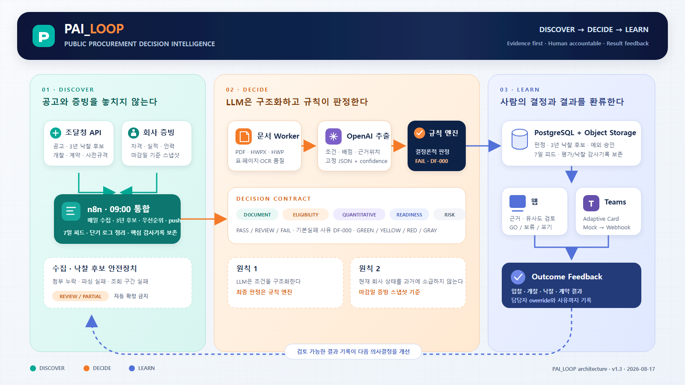

# PAI_LOOP

**Evidence-first public procurement decision intelligence**

PAI_LOOP는 조달 공고를 놓치지 않고, 공고 문서의 참가조건을 근거 위치와
함께 구조화한 뒤, **공고 마감일 당시 유효한 회사 증빙**과 비교하여 담당자의
입찰 의사결정을 돕는 시스템입니다.

LLM은 조건과 근거 후보를 구조화할 뿐입니다. 최종 적격성은 버전이 고정된
규칙 엔진이 `PASS / REVIEW / FAIL`로 판정하고, 실제 `GO / 보류 / NO-GO`는
사람이 근거와 함께 기록합니다.



## 현재 구현 범위: v0.4.0 daily decision-intelligence slice

- FastAPI + SQLAlchemy API, 반응형 한국어 SPA, PostgreSQL 온라인 저장 경계
- 전사 공통 `교육·컨설팅`과 24개 부서/센터 전문 키워드를 결합한 검색 우선순위
- 검색 주체 부서와 사용자 추가 키워드에 따라 달라지는 점수·근거·추천 부서
- 참가요건을 `적격성 / 행동 필요 / 체크리스트 / 정보`로 분리하는 정책 엔진
- 마감일 기준 증빙 Gate, AND/OR 경로, REVIEW와 `FAIL(reason=DF-000)`을 다루는 평가 엔진
- 실제 공개 인천 공고의 정제 seed: 요구조건 23건, 근거 앵커 26건
- 공개 가능한 실제 실적 1,182건의 검색·연도·사업부 필터와 페이지 조회
- 실제 제안요청서의 20점 정량표를 원문 SHA-256·페이지와 연결한 조건부 점수 범위·의견
- 공개 안전 낙찰 이력 59건을 이용한 3년 수주 집중도·낙찰률 범위·가격 참고 예측
- 원문 대신 해시·유효 메타데이터만 공개하는 회사 자격 프로필
- 제한된 조달청 공고/낙찰 후보 수집, OpenAI strict-schema 추출과 원문 인용 재검증
- GitHub Actions 검증, n8n 이름 기반 멱등 배포, Teams 승인 전 Adaptive Card mock
- 매일 09:00 KST에 최근 7일 공고·부서 우선순위·정량·가격 신호를 한 카드로 묶는 통합 n8n 진입점
- 공모전용 익명 읽기 허용 목록과 모든 쓰기를 서버 키로 막는 public-read-only 경계

GitHub에는 공개 런타임 코드·규칙·부서 키워드와 검토를 마친 불변 seed만 둡니다.
온라인 실행 데이터와 검토 이력의 기준 시스템은 관리형 PostgreSQL입니다.
사내 원천 어댑터와 원천 파일은 이 공개 저장소·배포 패키지의 구성요소가 아닙니다.
실제 입찰 자격이나 법률 판단을 대신하지 않으며, 전사 쓰기 기능은 Entra
SSO/RBAC 및 회사 승인 전까지 차단합니다.

낙찰 이력도 동일 사업을 확정하는 데이터가 아닙니다. 공고명에서 생성하거나
담당자가 입력한 키워드로 후보를 조회한 뒤, 토큰 겹침과 한글 3-gram 유사도를
혼합한 점수를 함께 보여주는 **검토용 후보 목록**입니다. 사업 범위·발주기관·
기간·과업 내용은 담당자가 다시 확인해야 합니다.

## 빠른 로컬 실행

Python 3.11 이상이 필요합니다.

```powershell
python -m venv .venv
.\.venv\Scripts\Activate.ps1
python -m pip install -e ".[test]"
Copy-Item .env.example .env
$env:PAI_LOOP_SEED_SYNTHETIC="true"
uvicorn pai_loop.main:app --host 127.0.0.1 --port 8000
```

브라우저에서 `http://127.0.0.1:8000`을 열면 됩니다. API 문서는
`http://127.0.0.1:8000/api/docs`, 상태 확인은 `/healthz`입니다.

합성 데이터를 수동으로 넣으려면:

```powershell
Invoke-RestMethod -Method Post -Uri http://127.0.0.1:8000/api/v1/ingestion/replay
```

합성 fixture에는 `SYN-` 접두사를 사용하며 실제 회사정보나 개인정보를
포함하지 않습니다.

실제 공개 인천 공고 seed를 현재 DB에 멱등 적재하려면:

```powershell
pai-loop-seed-public-notice --create-schema
```

공개 실적과 회사 자격 프로필은 버전·해시가 검증된 패키지 자산으로
제공됩니다. 공개 앱에는 이 자산을 읽고 검증하는 코드만 포함되며, 사내 원천
형식·반입 코드·원천 파일은 저장소나 컨테이너 build context에 포함하지 않습니다.

## 테스트

```powershell
pytest --cov=pai_loop --cov-report=term-missing
node scripts/deploy-workflows.mjs --validate-only
node scripts/test-daily-workflow.mjs
```

CI는 Python 테스트, n8n JSON/연결/Code 문법 검증과 공개 저장소용 비밀값
패턴 검사를 실행합니다.

## API baseline

| Method | Endpoint | Purpose |
|---|---|---|
| `GET` | `/healthz` | 서비스/DB 상태 |
| `GET` | `/api/v1/runtime-profile` | 공개 읽기/쓰기 경계 |
| `GET` | `/api/v1/dashboard` | 요약 및 마감 현황 |
| `GET` | `/api/v1/notices` | 검색·부서 우선순위·사용자 키워드 목록 |
| `GET` | `/api/v1/notices/{notice_key}` | 근거·평가·결정 상세 |
| `GET` | `/api/v1/departments/keyword-profiles` | 부서별 검색 키워드 registry |
| `GET` | `/api/v1/company-profile` | 공개 가능한 회사 자격 프로필 |
| `GET` | `/api/v1/notices/{notice_key}/analysis/requirement-policy` | 적격성/행동/체크/정보 분류 |
| `GET` | `/api/v1/performance/summary` | 공개 실적 집계 |
| `GET` | `/api/v1/performance` | 공개 실적 검색·필터·페이지 조회 |
| `POST` | `/api/v1/notices/{notice_key}/evaluate` | 버전 규칙 재평가 |
| `POST` | `/api/v1/notices/{notice_key}/decisions` | 담당자 결정 기록 |
| `POST` | `/api/v1/ingestion/replay` | 합성 회귀 fixture 재생 |
| `POST` | `/api/v1/ingestion/pps/notices` | 조달청 실공고 bounded upsert |
| `GET` | `/api/v1/ingestion/jobs` | 비밀값 없는 수집 감사로그 |
| `POST` | `/api/v1/notices/{notice_key}/analysis/extractions` | 공개 공고문 근거 구조화 |
| `POST` | `/api/v1/notices/{notice_key}/award-history/refresh` | 최대 3년 낙찰 후보 제한 수집·멱등 갱신 |
| `GET` | `/api/v1/notices/{notice_key}/award-history` | 저장된 낙찰 후보와 제목 유사도 조회 |
| `GET` | `/api/v1/notices/{notice_key}/award-intelligence` | 저장 이력 기반 3년 집중도·낙찰률·금액 범위 분석 |
| `GET` | `/api/v1/notices/{notice_key}/quantitative-estimate` | 원문 배점표·공개 근거 기반 정량 하한~상한과 의견 |
| `POST` | `/api/v1/notices/{notice_key}/notifications/teams/mock` | Teams 카드 모의 기록 |
| `GET` | `/api/v1/notifications/mock` | Teams 모의 로그 조회 |
| `GET` | `/api/v1/operations/daily-briefing` | 외부 호출 없이 저장된 최근 7일 공고 브리핑 조립 |
| `POST` | `/api/v1/operations/retention` | 완료 수집로그·mock 알림 7일 보관 preview/apply |

## n8n 배포

운영자가 실행할 통합 진입점은 `PAI_LOOP 10 - Daily Opportunity Briefing`이다.
매일 09:00 Asia/Seoul, 최근 7일 피드, 부서 우선순위, 저장된 적합성·선택적
정량/가격 신호, Teams 통합 카드 mock을 한 번에 검증한다. 기존 00~04는
비활성 계약 시험/rollback 자산이며 실제 운영 시 따로 누르지 않는다.

`main`에 `workflows/**`, `manifest.json` 또는 배포 스크립트 변경이 push되면
GitHub Actions가 workflow를 검증하고 n8n에 이름 기준으로 생성/갱신합니다.
manifest에서 `publish: false`인 워크플로는 배포 후에도 비활성 상태를
강제합니다.

`PAI_LOOP 04 - Award History Refresh`도 기본 비활성입니다. 수동 실행은 항상
dry-run이고, schedule/sub-workflow의 저장 실행은
`PAI_LOOP_LIVE_INGESTION_ENABLED=true`일 때만 허용됩니다. 대상 공고키는
입력값을 우선 사용하며, 승인된 n8n 환경변수 fallback만 허용합니다.

필수 GitHub Actions secrets:

- `N8N_BASE_URL`
- `N8N_API_KEY`

OpenAI·조달청·PAI LOOP 서버 키는 배포 스크립트가 workflow JSON에 넣지 않습니다. n8n
credential store 또는 서버 환경변수에서만 주입합니다. n8n 화면에서 직접
수정했다면 JSON을 먼저 GitHub에 동기화해야 하며, GitHub를 소스 오브
트루스로 유지합니다.

## 배포 방향

공모전 데모는 **FastAPI + 현재 SPA 단일 컨테이너 + 관리형 PostgreSQL**로
배포합니다. [`render.yaml`](render.yaml)은 CI 통과 후 자동 배포, production
보안 기본값과 실제 공개 공고 최초 적재를 선언합니다. Streamlit 계정은
있지만 현재 앱을 다시 작성하고 인증 경계를 이중화해야 하므로 이번 호스트로
사용하지 않습니다.

사내 파일럿은 독립 웹을 기준 제품으로 두고 Teams는 알림/진입점과 탭으로
연결합니다. 회사 승인이 나기 전에는 실제 Teams 전송 없이 mock만 기록합니다.
자세한 비교와 운영 Gate는
[`docs/DEPLOYMENT_STRATEGY_v0.2.0.md`](docs/DEPLOYMENT_STRATEGY_v0.2.0.md)에
있습니다.

## 보안 경계

- `.env`, `secrets.txt`, API 키, Teams webhook URL, 실제 첨부, 내부 데이터행,
  전체 추출문은 Git에 올리지 않습니다.
- 낙찰 후보에는 공고번호·공고명·발주기관·낙찰 법인명·참가 수·금액·낙찰률·
  개찰/낙찰일과 유사도만 저장합니다. 사업자번호·대표자·주소·전화·담당자는
  API 정규화 경계에서 폐기합니다.
- OpenAI에는 호출자가 명시적으로 선택한 공개 공고 텍스트만 최대 120,000자로
  전송합니다. 문서 속 지시문을 신뢰하지 않으며 strict schema와 근거-anchor
  검증을 거칩니다.
- 공모전 공개 URL은 `PAI_LOOP_PUBLIC_READ_ONLY=true`의 명시적 GET 허용 목록만
  익명 제공하며 결정·재수집·LLM 호출·Teams mock을 포함한 쓰기는 서버 인증을
  요구합니다.
- 공개 GitHub와 외부 심사용 배포에는 공개 조달공고, 비식별화한 공개 실적,
  파생 회사 자격 facts와 합성 회귀 fixture만 사용합니다. 원본 사내 파일,
  담당자 결정, 직접식별자와 비공개 메모는 포함하지 않습니다.
- 전사 배포 전에는 Entra SSO/RBAC, HTTPS, rate limit, 감사로그, 암호화 저장소와
  보존정책을 반드시 적용합니다.

보안 기준은 [`docs/SECURITY_AND_PRIVACY_v0.1.0.md`](docs/SECURITY_AND_PRIVACY_v0.1.0.md)와
[`docs/SECURITY_AND_PRIVACY_v0.2.0.md`](docs/SECURITY_AND_PRIVACY_v0.2.0.md),
OpenAI 계약은
[`docs/OPENAI_EXTRACTION_CONTRACT_v0.1.0.md`](docs/OPENAI_EXTRACTION_CONTRACT_v0.1.0.md)를
참조하세요.

## 설계 문서

- [Product blueprint](docs/PRODUCT_BLUEPRINT_v0.1.0.md)
- [Department keyword ranking v0.3.0](docs/DEPARTMENT_KEYWORD_RANKING_v0.3.0.md)
- [Quantitative scoring v0.3.0](docs/QUANTITATIVE_SCORING_v0.3.0.md)
- [Award and pricing intelligence v0.3.0](docs/PPS_AWARD_INTELLIGENCE_v0.3.0.md)
- [Daily 09:00 briefing runbook v0.4.0](docs/DAILY_BRIEFING_RUNBOOK_v0.4.0.md)
- [Morning decision backlog v0.4.0](docs/MORNING_REVIEW_BACKLOG_v0.4.0.md)
- [Company public profile and requirement policy v0.3.0](docs/COMPANY_PUBLIC_PROFILE_AND_REQUIREMENT_POLICY_v0.3.0.md)
- [Public performance data v0.3.0](docs/PUBLIC_PERFORMANCE_DATA_v0.3.0.md)
- [Public notice seed v0.3.0](docs/PUBLIC_NOTICE_SEED_v0.3.0.md)
- [Online deployment strategy v0.2.0](docs/DEPLOYMENT_STRATEGY_v0.2.0.md)
- [PPS API catalog](docs/PPS_API_CATALOG_v0.1.0.md)
- [PPS award-history contract](docs/PPS_AWARD_HISTORY_v0.2.0.md)
- [Release checklist v0.3.0](docs/RELEASE_CHECKLIST_v0.3.0.md)
- [Release checklist v0.4.0](docs/RELEASE_CHECKLIST_v0.4.0.md)
- [Architecture source and n8n embedding](docs/architecture/README.md)
- [Public data source register v0.3.0](docs/SOURCE_REGISTER_v0.3.0.md)
- [Historical source-handling register v0.1.0](docs/SOURCE_REGISTER_v0.1.0.md)

원본 기획안·업무인수인계·준비목록은 분석 입력으로만 사용했고 수정하거나
저장소에 복사하지 않았습니다. 새 산출물은 버전이 붙은 별도 파일로 관리합니다.
